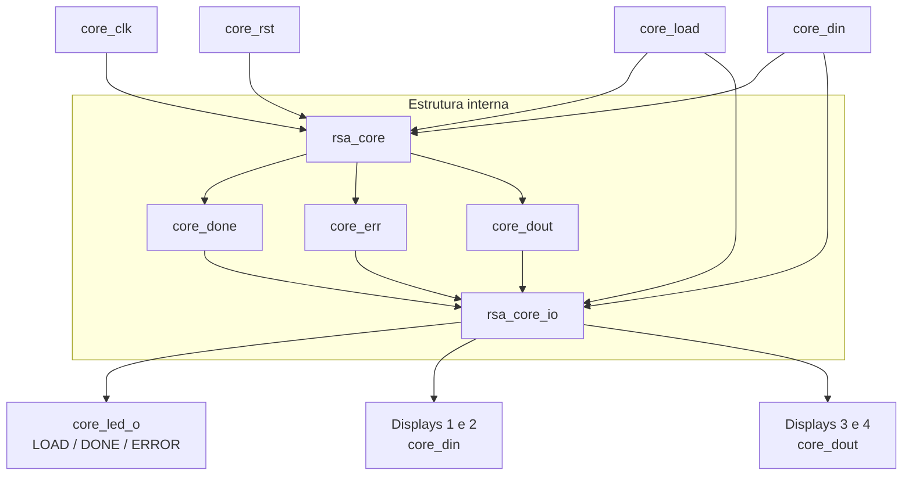
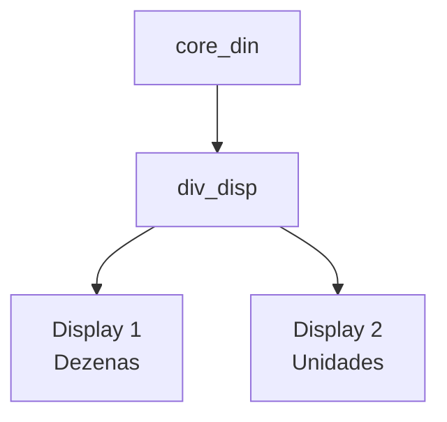
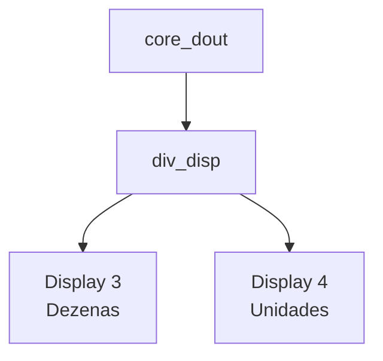

# RSA Top

## Descrição

O módulo **rsa_top** implementa o nível hierárquico superior do projeto RSA, realizando a integração entre o núcleo responsável pelo processamento matemático e o bloco responsável pela interface de entrada e saída.

A arquitetura é dividida em dois blocos principais:

- `rsa_core`: executa o processamento do algoritmo RSA e gera os sinais de resultado, conclusão e erro;
- `rsa_core_io`: realiza a interface visual do sistema, incluindo displays de 7 segmentos, indicação de carregamento, conclusão, erro e distribuição do clock para as saídas externas.

O módulo `rsa_top` não executa diretamente as operações matemáticas do RSA. Sua função principal é interligar os módulos internos e disponibilizar suas interfaces no nível superior do projeto.

## Parâmetros

| Parâmetro | Descrição |
|---|---|
| `DATA_WIDTH` | Define a largura, em bits, dos dados manipulados pelo núcleo RSA. O valor padrão é 4 bits. |
| `RESET` | Define o nível lógico ativo utilizado pelo reset do núcleo RSA. O valor padrão é `1'b1`. |
| `LOAD` | Define o nível lógico ativo utilizado pelo sinal de carregamento de dados. O valor padrão é `1'b1`. |

## Entrada e saída

| Sinal | Direção | Largura | Descrição |
|---|---|---:|---|
| `core_clk` | Entrada | 1 bit | Clock principal do sistema. |
| `core_rst` | Entrada | 1 bit | Sinal de reset do sistema. |
| `core_load` | Entrada | 1 bit | Sinal utilizado para carregar os valores de entrada no núcleo RSA. |
| `core_din` | Entrada | `DATA_WIDTH` | Barramento de dados de entrada do núcleo RSA. |
| `core_done` | Saída | 1 bit | Indica que o processamento RSA foi concluído. |
| `core_err` | Saída | 1 bit | Indica a ocorrência de uma condição de erro no núcleo RSA. |
| `core_dout` | Saída | `DATA_WIDTH` | Resultado produzido pelo núcleo RSA. |
| `core_clk_o` | Saída | 2 bits | Réplicas do clock utilizadas pela interface externa. |
| `core_led_o` | Saída | 6 bits | Barramento utilizado para indicação visual de LOAD, DONE e ERROR. |
| `core_din_disp1` | Saída | 7 bits | Display das dezenas correspondente ao valor presente em `core_din`. |
| `core_din_disp2` | Saída | 7 bits | Display das unidades correspondente ao valor presente em `core_din`. |
| `core_dout_disp3` | Saída | 7 bits | Display das dezenas correspondente ao resultado presente em `core_dout`. |
| `core_dout_disp4` | Saída | 7 bits | Display das unidades correspondente ao resultado presente em `core_dout`. |

## Comportamento esperado

O módulo `rsa_top` recebe o clock, reset, sinal de carregamento e barramento de dados utilizados pelo sistema.

Os sinais `core_clk`, `core_rst`, `core_load` e `core_din` são encaminhados ao módulo `rsa_core`, responsável pela execução do processamento RSA.

O núcleo produz:

- `core_done`, indicando a conclusão do processamento;
- `core_err`, indicando uma condição de erro;
- `core_dout`, contendo o resultado da operação;
- uma réplica interna do clock utilizada na interconexão com o módulo de I/O.

Esses sinais são encaminhados ao módulo `rsa_core_io`, que transforma o estado interno do sistema em indicações visuais.

Os displays são divididos em dois grupos:

- Displays 1 e 2 apresentam o valor de entrada `core_din`;
- Displays 3 e 4 apresentam o valor de saída `core_dout`.

Os LEDs são controlados de acordo com os estados de carregamento, conclusão e erro.

## Hierarquia

A estrutura principal do projeto é:

```text
rsa_top
|
+-- rsa_core
|   |
|   +-- rsa_core_mult
|   +-- rsa_core_mod
|   +-- rsa_core_ctrl
|
+-- rsa_core_io
    |
    +-- div_disp            -> core_din
    |   +-- disp7seg
    |   +-- disp7seg
    |
    +-- div_disp            -> core_dout
    |   +-- disp7seg
    |   +-- disp7seg
    |
    +-- rsa_core_io_load_snake
    +-- rsa_core_io_done
    +-- rsa_core_io_error
    +-- rsa_core_io_led_mux
```

No primeiro nível hierárquico, `rsa_top` possui somente duas instâncias diretas: `rsa_core` e `rsa_core_io`.

Essa divisão mantém separadas a lógica funcional do RSA e a lógica responsável pela interface física do projeto.

## Fluxo de dados

O fluxo principal pode ser representado por:



O `rsa_top` utiliza sinais intermediários do tipo `wire` para realizar a interconexão entre os módulos, mantendo os blocos funcionalmente separados.

## Interface de displays

O sistema utiliza quatro displays de 7 segmentos.

### Displays de entrada

Os displays 1 e 2 são conectados ao barramento `core_din`.



O primeiro display representa as dezenas e o segundo representa as unidades.

### Displays de saída

Os displays 3 e 4 são conectados ao barramento `core_dout`.



Dessa forma, a entrada e o resultado RSA podem ser observados simultaneamente.

## Interface de LEDs

O bloco `rsa_core_io` possui três geradores independentes de indicação:

- `rsa_core_io_load_snake`;
- `rsa_core_io_done`;
- `rsa_core_io_error`.

As três saídas são encaminhadas ao módulo `rsa_core_io_led_mux`.

A prioridade da indicação é:

**ERROR > DONE > LOAD**

Portanto:

- se `core_err` estiver ativo, o padrão de erro é selecionado;
- caso contrário, se `core_done` estiver ativo, o padrão de conclusão é selecionado;
- caso nenhuma das condições anteriores esteja ativa, o padrão de carregamento é apresentado.

## Indicação de LOAD

Uma borda de subida em `core_load` inicia uma animação circular nos seis LEDs.

A sequência esperada é:

```
000001
000010
000100
001000
010000
100000
000001
...
```

O deslocamento continua enquanto a indicação estiver ativa e `core_done` permanecer em zero.

Quando `core_done` é ativado, a animação de carregamento é encerrada.

## Indicação de DONE

Quando `core_done` é reconhecido, o módulo responsável pela indicação de conclusão coloca os seis LEDs em nível lógico alto:

```text
111111
```

Quando `core_done` retorna para zero, a indicação de conclusão também retorna para:

```text
000000
```

## Indicação de ERROR

Quando `core_err` está ativo, o bloco de erro produz um padrão alternado entre os LEDs.

Esse padrão possui prioridade sobre as demais indicações devido ao multiplexador final de LEDs.

## Características

- Estrutura hierárquica modular;
- Instancia diretamente apenas `rsa_core` e `rsa_core_io`;
- Separa processamento RSA da interface física;
- Possui largura de dados configurável por parâmetro;
- Utiliza um único clock principal;
- Disponibiliza sinalização de conclusão e erro;
- Possui seis LEDs para indicação do estado do sistema;
- Possui quatro displays de 7 segmentos;
- Displays 1 e 2 apresentam a entrada RSA;
- Displays 3 e 4 apresentam a saída RSA;
- Utiliza módulos independentes para LOAD, DONE e ERROR;
- Possui multiplexação de prioridade para as indicações por LED;
- Utiliza interconexões internas do tipo `wire` entre os módulos hierárquicos.

## Exemplo de funcionamento

Considerando a configuração padrão:

```text
DATA_WIDTH = 4
```

e supondo que:

```text
core_din = 4'b1101
```

o valor decimal apresentado nos displays de entrada é 13.

Assim:

```text
Display 1 = 1
Display 2 = 3
```

Durante o carregamento e processamento, os LEDs podem apresentar o padrão circular de LOAD.

Quando o núcleo concluir a operação, `core_done` é ativado e a indicação visual passa para:

```text
111111
```

Caso o resultado produzido pelo núcleo seja, por exemplo:

```text
core_dout = 4'b0111
```

os displays de saída apresentam:

```text
Display 3 = apagado
Display 4 = 7
```

permitindo observar simultaneamente o dado fornecido ao sistema e o resultado calculado.

## Aplicações

A estrutura pode ser utilizada em:

- Implementações didáticas de RSA em FPGA;
- Demonstrações de algoritmos criptográficos em hardware;
- Plataformas educacionais de lógica digital;
- Validação visual de operações realizadas pelo núcleo RSA;
- Prototipagem de sistemas criptográficos;
- Interfaces simples para depuração de hardware;
- Sistemas digitais que necessitem separar processamento e interface física em níveis hierárquicos distintos.

## Observações

O módulo `rsa_top` atua principalmente como elemento de integração. As operações matemáticas e a máquina de controle do algoritmo RSA permanecem encapsuladas dentro do módulo `rsa_core`.

O módulo `rsa_core_io` utiliza os sinais produzidos pelo núcleo apenas para indicação e apresentação visual, não participando diretamente do cálculo RSA.

Os módulos `div_disp` utilizados pela interface de displays recebem valores de 4 bits. Portanto, com a configuração padrão `DATA_WIDTH = 4`, os valores apresentados estão limitados à faixa de 0 a 15.

Caso `DATA_WIDTH` seja aumentado, a lógica dos displays deve ser revisada para tratar corretamente valores com largura superior a 4 bits.

A codificação dos displays de 7 segmentos considera a convenção adotada pelo módulo `disp7seg`. Caso a placa utilize segmentos ativos em nível lógico baixo, a codificação deverá ser adaptada à interface física correspondente.
